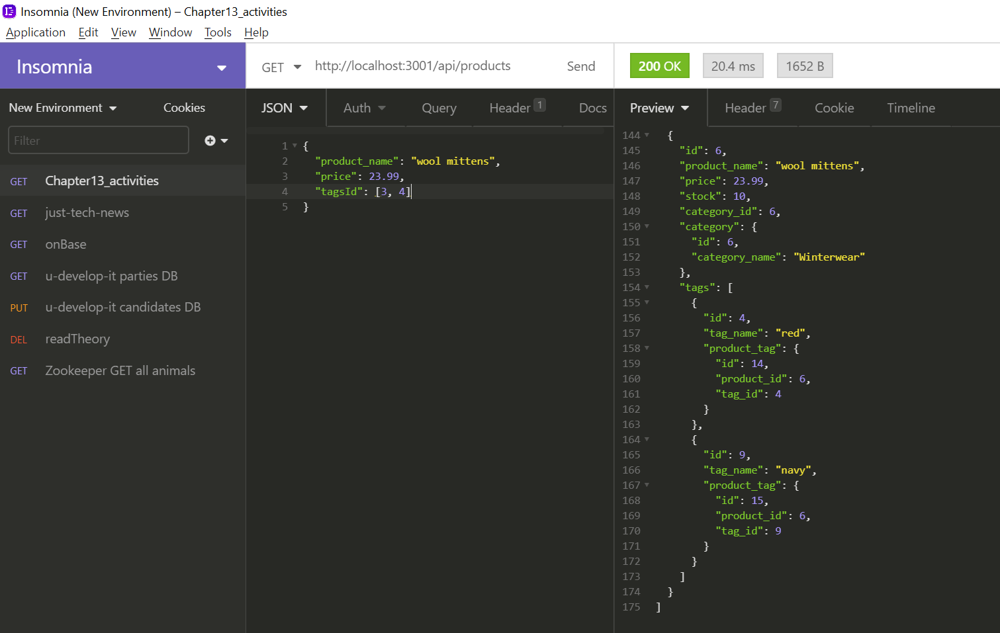

# E-commerce Back End

## Description
This application represents the back end of an e-commerce site using Sequelize to interact with a MySQL database.

### Languages used:
- MySQL
- Node.js
- ES6
- Javascript

### NPM Packages:
- MySQL2
- Sequelize
- Express
- dotenv

## Table of Contents:
- [Instructions for Installation](#instructions-for-installation)
- [Usage](#usage)
- [Contributions](#contribution-guidelines)
- [Questions?](#questions?)

## <a name="instructions-for-installation">Instructions for Installation</a>:
1. Clone bumbershootMagic repository,
1. Enter your MySQL user name and password into .env file,
1. Install Node.js ('npm init --y'),
1. From the terminal, run 'npm start' to instantiate the server and trigger creation of the database,
1. From the terminal, enter "npm run seed", and
1. From the terminal, run 'npm start'.

## <a name="usage">Usage</a>:
[*Click the image-link to access a video walkthrough of the application:*]("https://drive.google.com/file/d/1JCVegcQxAKZSh0VNObS1mEwHjHBLnmZ5/view")

    
## <a name="contribution-guidelines">Contributions</a>:
Made with ☕+❤️ by Sara Krizan and in consultation with several LAs, TA, and learning instructor through the University of Wisconsin Extended Campus Coding Bootcamp.

Please feel free to contact me via my GitHub account below with any requests to contribute to this project or collaborate on future works.
    

## <a name="questions?">Questions?</a> 
Sara Krizan    
[GitHub](https://github.com/SMKrizan)
    
